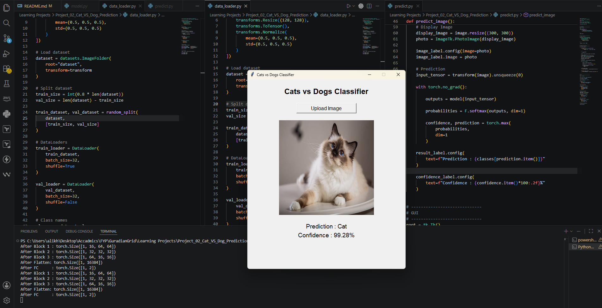

# Project 02 - Cats vs Dogs Image Classification using CNN

This project builds a Convolutional Neural Network (CNN) from scratch using PyTorch to classify images as either **Cat** or **Dog**.

Unlike the MNIST project, this project works with **RGB images**, multiple convolutional layers, and includes a complete training and validation pipeline.

---

# Project Structure

```
Project_02_Cat_VS_Dog_Prediction/

│
├── data_loader.py          # Loads and preprocesses the dataset
├── model.py                # CNN architecture
├── train.py                # Training & validation loop
├── predict.py              # GUI application for image prediction
├── requirements.txt
├── README.md
│
├── saved_models/
│     └── best_model.pth
│
└── dataset/
      ├── Cat/
      └── Dog/
```

---

# Dataset

The dataset consists of two classes:

- Cat
- Dog

The dataset is loaded using PyTorch's `ImageFolder` class.

The images are automatically:

- Resized to **128 × 128**
- Converted into tensors
- Normalized
- Split into training and validation datasets

---

# CNN Architecture

```
Input Image (3 × 128 × 128)
            │
            ▼
Conv Block 1
Conv → ReLU → MaxPool
            │
            ▼
16 × 64 × 64
            │
            ▼
Conv Block 2
Conv → ReLU → MaxPool
            │
            ▼
32 × 32 × 32
            │
            ▼
Conv Block 3
Conv → ReLU → MaxPool
            │
            ▼
64 × 16 × 16
            │
            ▼
Flatten
            │
            ▼
16384 Features
            │
            ▼
Fully Connected Layer
            │
            ▼
2 Output Logits
```

---

# Training Pipeline

For every batch:

1. Load a batch of images
2. Perform a forward pass
3. Calculate Cross Entropy Loss
4. Perform backpropagation
5. Update model weights using Adam Optimizer

This process repeats for every epoch.

---

# Validation Pipeline

After every epoch:

- Switch the model to evaluation mode
- Disable gradient calculations
- Predict on the validation dataset
- Calculate:
  - Validation Loss
  - Validation Accuracy

The best-performing model is automatically saved.

---

# Model Checkpointing

Instead of saving the model after every epoch, the project saves only the model with the highest validation accuracy.

```
saved_models/
    best_model.pth
```

This ensures that the best-performing model is always available for inference.

---

# Prediction Application

The project includes a simple desktop application built with **Tkinter**.

Features:

- Upload any image
- Automatically resize and preprocess it
- Predict whether the image is a Cat or Dog
- Display prediction confidence
- Preview the uploaded image

Run the application:

```bash
python predict.py
```

---

# Training

Run:

```bash
python train.py
```

Example output:

```
Epoch [1/10]
Train Loss : 0.6241
Val Loss   : 0.5318
Val Acc    : 79.34%

...

Training Complete!
Best Validation Accuracy: 84.07%
```

---

# Requirements

Install dependencies:

```bash
pip install -r requirements.txt
```

---

# Concepts Covered

This project covers:

- ImageFolder Dataset
- Image Preprocessing
- Resize
- Tensor Conversion
- Image Normalization
- DataLoader
- Train / Validation Split
- Convolutional Neural Networks (CNN)
- Multiple Convolution Layers
- ReLU Activation
- Max Pooling
- Flatten Layer
- Fully Connected Layer
- Forward Pass
- Cross Entropy Loss
- Backpropagation
- Adam Optimizer
- Training Loop
- Validation Loop
- Accuracy Calculation
- Model Checkpointing
- PyTorch Model Saving & Loading
- GUI-Based Image Prediction using Tkinter

---

# Skills Demonstrated

- PyTorch
- Computer Vision
- Convolutional Neural Networks
- Image Classification
- Deep Learning Training Pipeline
- Model Evaluation
- Model Inference
- GUI Development with Tkinter

---

# Future Improvements

Possible improvements include:

- Batch Normalization
- Dropout
- Data Augmentation
- Learning Rate Scheduler
- Transfer Learning (ResNet, EfficientNet)
- Flask / FastAPI Web Interface
- Streamlit Deployment
- Next.js Frontend Integration

---

# Learning Outcome

By completing this project, I learned how to:

- Build a CNN from scratch for RGB image classification.
- Design a complete training and validation pipeline.
- Evaluate model performance using validation accuracy.
- Save and load the best-performing model.
- Build a simple desktop application for model inference.
- Understand the workflow of a real-world image classification project.