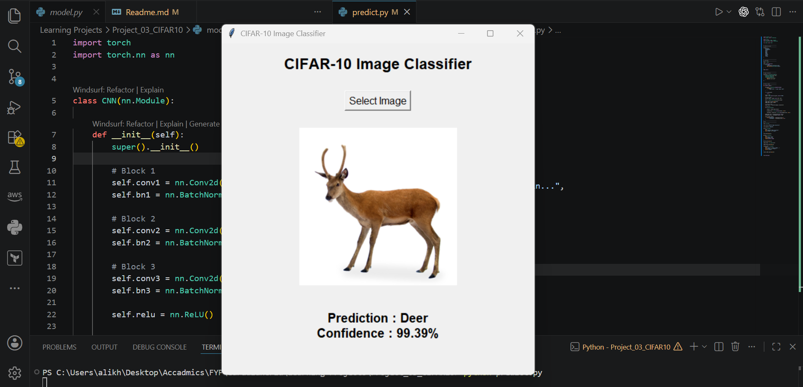

# Project 03 - CIFAR-10 Image Classification using CNN


## Overview

This project builds a modern Convolutional Neural Network (CNN) from scratch using PyTorch to classify images from the CIFAR-10 dataset.

Unlike the previous projects, this model introduces two important deep learning techniques:

- Batch Normalization
- Dropout Regularization

These techniques improve training stability, convergence speed, and model generalization.

---

## Dataset

Dataset: CIFAR-10

The dataset contains 60,000 RGB images belonging to 10 different classes.

### Classes

- Airplane
- Automobile
- Bird
- Cat
- Deer
- Dog
- Frog
- Horse
- Ship
- Truck

### Image Size

```
32 × 32 × 3
```

### Dataset Split

- Training Images: 50,000
- Test Images: 10,000

---

## Model Architecture

```
Input (3 × 32 × 32)

↓

Conv2D (3 → 32)

↓

BatchNorm

↓

ReLU

↓

MaxPool

↓

Conv2D (32 → 64)

↓

BatchNorm

↓

ReLU

↓

MaxPool

↓

Conv2D (64 → 128)

↓

BatchNorm

↓

ReLU

↓

MaxPool

↓

Flatten

↓

Dropout (0.5)

↓

Fully Connected

↓

10 Output Classes
```

---

## Features

- Custom CNN built from scratch
- Three Convolution Blocks
- Batch Normalization
- Dropout Regularization
- Adam Optimizer
- CrossEntropy Loss
- Automatic Best Model Saving
- Tkinter GUI for Image Prediction

---

## Training

Training includes:

- Forward Pass
- Loss Calculation
- Backpropagation
- Weight Updates
- Validation after every epoch
- Best Model Checkpointing

---

## Results

Best Test Accuracy:

```
81.06%
```

---

## Project Structure

```
Project_03_CIFAR10_Classification/

│── data_loader.py
│── model.py
│── train.py
│── predict.py
│── requirements.txt
│── README.md

├── saved_models/
│      └── cifar10_cnn.pth

└── data/
```

---

## Installation

Clone the repository

```bash
git clone <repository-url>
```

Install the dependencies

```bash
pip install -r requirements.txt
```

---

## Train the Model

```bash
python train.py
```

---

## Run Prediction GUI

```bash
python predict.py
```

Select an image and the model will predict its class.

---

## Concepts Learned

Through this project, the following deep learning concepts were explored:

- CIFAR-10 Dataset
- RGB Image Processing
- Data Normalization
- Multi-Class Classification
- Batch Normalization
- Dropout
- Convolutional Neural Networks
- Training and Evaluation
- Model Checkpointing
- GUI-based Image Prediction

---

## Future Improvements

Possible improvements include:

- Data Augmentation
- Learning Rate Scheduling
- Transfer Learning (ResNet, EfficientNet)
- Confusion Matrix
- Precision and Recall
- GPU Training
- Flask/FastAPI Web Deployment

---

## Author

Ali Khan

Software Engineer
