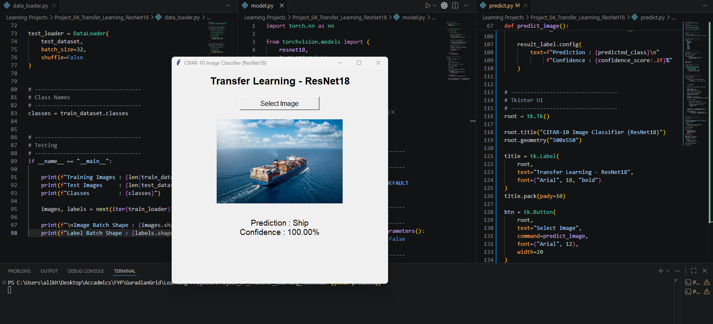

# Project 04 – Transfer Learning with ResNet18 (CIFAR-10)

> Learn how to leverage a pretrained deep neural network using **Transfer Learning** instead of building a CNN from scratch.

---



## Project Overview

In the previous projects, I designed and trained Convolutional Neural Networks (CNNs) from scratch. While this approach helped me understand the fundamentals of deep learning, modern computer vision applications often use **pretrained models** that have already learned rich visual representations from millions of images.

In this project, I explored **Transfer Learning** by using **ResNet18**, a pretrained model available in PyTorch. Instead of designing my own convolutional layers, I reused the powerful feature extractor learned from the **ImageNet** dataset and replaced the final classification layer to classify the **10 CIFAR-10 classes**.

This project helped me understand how industry-grade computer vision models are adapted for new tasks with minimal architectural changes.

---

# What I Learned

Throughout this project, I learned several important deep learning concepts:

* Understanding **Transfer Learning**
* Working with **pretrained models**
* Understanding the **ImageNet** dataset
* Using **ResNet18** from `torchvision`
* Replacing the final fully connected classification layer
* Freezing pretrained layers using `requires_grad=False`
* Understanding the difference between **freezing** and **fine-tuning**
* Data augmentation using `RandomCrop` and `RandomHorizontalFlip`
* Training pretrained models on custom datasets
* Saving the best model based on validation accuracy
* Building a desktop prediction application using **Tkinter**
* Deploying and training the model on an **AWS EC2** instance

---

# Project Structure

```text
Project_04_Transfer_Learning/
│
├── data/
│
├── data_loader.py
├── model.py
├── train.py
├── predict.py
├── requirements.txt
├── resnet18_transfer_learning.pth
├── README.md
└── __pycache__/
```

---

# Dataset

**Dataset:** CIFAR-10

Classes:

* Airplane
* Automobile
* Bird
* Cat
* Deer
* Dog
* Frog
* Horse
* Ship
* Truck

The dataset is automatically downloaded using `torchvision.datasets.CIFAR10`.

---

# Data Preprocessing

## Training Transformations

* Resize → 224 × 224
* Random Horizontal Flip
* Random Crop
* Convert to Tensor
* ImageNet Normalization

## Testing Transformations

* Resize → 224 × 224
* Convert to Tensor
* ImageNet Normalization

---

# Model Architecture

Instead of building a CNN manually, this project uses:

**ResNet18 (Pretrained on ImageNet)**

### Changes Made

* Loaded pretrained ImageNet weights
* Froze all pretrained convolution layers
* Replaced the final fully connected layer with:

```python
nn.Linear(in_features, 10)
```

Only the final classifier was trained for the CIFAR-10 dataset.

---

# Layer Freezing

One of the key concepts learned in this project was **Freezing Layers**.

```python
for parameter in self.model.parameters():
    parameter.requires_grad = False
```

Frozen layers:

* Continue extracting visual features
* Do **not** update their weights during backpropagation

This significantly reduces the number of trainable parameters while preserving the knowledge learned from ImageNet.

---

# Training Configuration

* Optimizer: Adam
* Learning Rate: 0.001
* Loss Function: CrossEntropyLoss
* Epochs: 10
* Batch Size: 32

The model with the highest validation accuracy is automatically saved.

---

# Training Result

**Best Test Accuracy**

```text
80.71%
```

Training was performed on an **AWS EC2 CPU instance**, taking approximately:

```text
5 Hours 38 Minutes
```

This highlighted the computational cost of training deep neural networks on CPUs and reinforced the importance of GPUs for deep learning workloads.

---

# Prediction Application

A desktop GUI was built using **Tkinter**.

Features:

* Select an image
* Display the uploaded image
* Predict one of the 10 CIFAR-10 classes
* Display prediction confidence

---

# Comparison with My Custom CNN

| Model                   | Test Accuracy |
| ----------------------- | ------------: |
| Custom CNN (Project 03) |    **81.06%** |
| Frozen ResNet18         |    **80.71%** |

Although the custom CNN achieved a slightly higher CIFAR-10 test accuracy, qualitative testing on real-world images showed that the pretrained ResNet18 produced significantly more confident and accurate predictions.

Examples observed during testing:

| Real Image | Custom CNN      | ResNet18              |
| ---------- | --------------- | --------------------- |
| Ship       | ✅ Ship (96.47%) | ✅ Ship (100%)         |
| Bird       | ✅ Bird (70.44%) | ✅ Bird (97.35%)       |
| Automobile | ❌ Bird (42.63%) | ✅ Automobile (91.29%) |

This demonstrates one of the major strengths of transfer learning: pretrained models often generalize better to real-world images because they have already learned rich visual features from millions of images.

---

# Installation

Clone the repository

```bash
git clone <repository-url>
```

Install dependencies

```bash
pip install -r requirements.txt
```

---

# Train

```bash
python train.py
```

---

# Run Prediction

```bash
python predict.py
```

---

# Key Concepts Covered

* Transfer Learning
* ImageNet
* ResNet18
* Pretrained Models
* Feature Extraction
* Layer Freezing
* Fine-Tuning (Theory)
* Data Augmentation
* Image Classification
* Model Evaluation
* PyTorch
* Computer Vision

---

# Future Improvements

* Fine-tune the last ResNet blocks instead of freezing the entire backbone.
* Train using GPU acceleration for faster convergence.
* Compare multiple pretrained architectures such as ResNet34, EfficientNet, and MobileNet.
* Experiment with learning rate scheduling and early stopping.
* Deploy the model as a web application using Flask or FastAPI.

---

# Author

**Ali Khan**

Software Engineering Student | Full Stack Developer | Deep Learning Learner

This project is part of my **Deep Learning Portfolio**, where I progressively build practical computer vision applications while learning the theory behind modern deep learning architectures.
