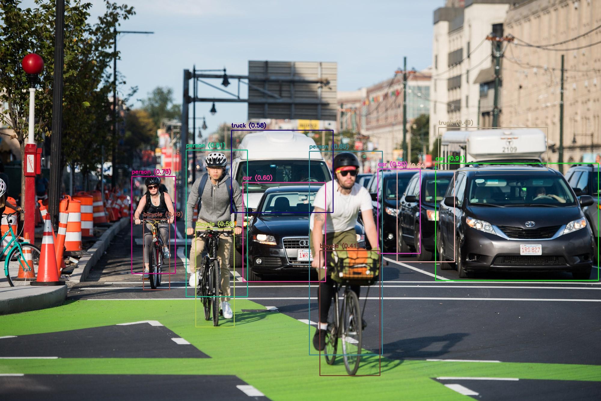

# Project 05 – YOLOv8 Object Detection



## Overview

This project introduces **real-time object detection** using **YOLOv8 Nano (YOLOv8n)** and marks the transition from image classification to object detection in my Deep Learning journey.

Unlike previous CNN-based classification projects that assign a single label to an entire image, this project detects **multiple objects simultaneously**, predicts their **bounding boxes**, **confidence scores**, and **class labels**, and visualizes the detections using **OpenCV**.

Rather than relying on YOLO's built-in visualization methods, the complete visualization pipeline is implemented manually to understand how modern object detection systems work internally.

---

# Objectives

* Learn the fundamentals of YOLOv8.
* Understand the difference between image classification and object detection.
* Understand the structure of YOLO prediction outputs.
* Process YOLO detection results manually.
* Draw bounding boxes and labels using OpenCV.
* Build the foundation for future surveillance projects such as GuardianGrid.

---

# Technologies Used

* Python
* PyTorch
* Ultralytics YOLOv8
* OpenCV
* NumPy

---

# Features

* Detect multiple objects in a single image.
* Use a pretrained YOLOv8 Nano model.
* Display bounding boxes.
* Display confidence scores.
* Display object class names.
* Apply confidence threshold filtering.
* Save the detected output image.
* Clean and modular project structure.

---

# Project Structure

```text
05_YOLO_Object_Detection/

│
├── images/
│   └── test.jpg
│
├── output/
│   └── detected_image.jpg
│
├── detect.py
├── requirements.txt
└── README.md
```

---

# Detection Pipeline

```text
Input Image

↓

YOLOv8 Model

↓

Prediction Results

↓

Bounding Box Coordinates

↓

Confidence Scores

↓

Class IDs

↓

Convert Class IDs → Class Names

↓

Draw Bounding Boxes

↓

Draw Labels

↓

Display & Save Final Image
```

---

# Concepts Learned

* YOLO (You Only Look Once)
* Real-Time Object Detection
* COCO Dataset
* Bounding Boxes
* Confidence Scores
* Class IDs
* Result Object
* Boxes Object
* OpenCV Visualization
* Detection Pipeline

---

# Sample Output

The application displays:

* Bounding boxes around detected objects.
* Object names.
* Confidence scores.
* Saved output image in the `output/` directory.

---

# Key Learning Outcomes

After completing this project, I can:

* Explain why YOLO performs only one forward pass.
* Describe the difference between classification and detection.
* Interpret YOLO prediction outputs.
* Process detection results programmatically.
* Draw custom bounding boxes using OpenCV.
* Build complete object detection applications without relying on built-in visualization methods.

---

# Future Improvements

* Webcam object detection.
* Video object detection.
* FPS monitoring.
* Object counting.
* Custom YOLO training.
* Weapon detection.
* Fire & Smoke detection.
* Face Mask detection.
* GuardianGrid AI Surveillance System.

---

# Author

**Ali Khan**

Software Engineering Student | Full Stack Developer | Deep Learning Learner

This project is part of my Deep Learning Portfolio documenting my journey from CNN fundamentals to real-time AI surveillance systems.
